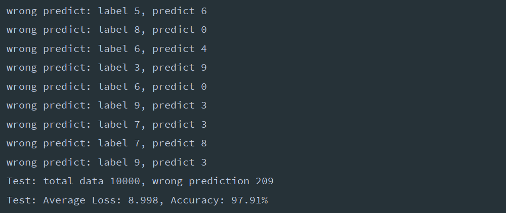

# LeNet5

LeNet5项目实现了基于LeNet-5模型手写数字识别算法。


## MNIST数据集

[MNIST手写数字数据库](http://yann.lecun.com/exdb/mnist/) 的训练集包含60,000个样本，
测试集包含10,000个样本。它是NIST的一个子集。
这些数字图像都规格化为28×28的灰度图像，并且数字都位于图像的中央。该数据库包含四个文件：
- train-images-idx3-ubyte.gz：训练集图像 (9912422 bytes)
- train-labels-idx1-ubyte.gz：训练集标签 (28881 bytes)
- t10k-images-idx3-ubyte.gz：测试集图像 (1648877 bytes)
- t10k-labels-idx1-ubyte.gz：测试集标签 (4542 bytes)

MNIST数据库由NIST的特殊数据库3（SD-3）和特殊数据库1（SD-1）构成，它们包含手写数字的二进制图像。
其中SD-3数据来自人口普查工作人员，SD-1来自高中生。SD-3比SD-1更容易识别。

MNIST训练集由SD-3中的30,000个样本和SD-1中的30,000个样本组成；
测试集由SD-3中的5,000个样本和SD-1中的5,000个样本组成。
训练集数据包含来自大约250位作者。训练集和测试集的作者不相交。

训练集标签文件的数据格式：
```
[offset] [type]          [value]          [description]
0000     32 bit integer  0x00000801(2049) magic number (MSB first)
0004     32 bit integer  60000            number of items
0008     unsigned byte   ??               label
0009     unsigned byte   ??               label
........
xxxx     unsigned byte   ??               label
```
label的值为0到9。

训练集图像文件的数据格式：
```
[offset] [type]          [value]          [description]
0000     32 bit integer  0x00000803(2051) magic number
0004     32 bit integer  60000            number of images
0008     32 bit integer  28               number of rows
0012     32 bit integer  28               number of columns
0016     unsigned byte   ??               pixel
0017     unsigned byte   ??               pixel
........
xxxx     unsigned byte   ??               pixel
```
pixel按行组织。像素值为0到255。0表示背景（白色），255表示前景（黑色）。

测试集文件的数据格式相同，只是其中的number of items和number of images为10,000。


## CNN

卷积神经网络CNN（Convolutional Neural Network）是一种特殊的多层神经网络。
与其他神经网络一样，它们也使用反向传播算法进行训练。
卷积神经网络与普通神经网络的区别在于，卷积神经网络包含了一个由卷积层和子采样层构成的特征抽取器。

如图所示是一个典型的CNN架构：


一个卷积层中通常包含若干个卷积核。输入图像经过一个卷积核处理后得到一个特征图（Feature Map），
它表示由卷积核提取出来的图像特征。卷积核一般以随机小数矩阵的形式初始化，
在网络的训练过程中卷积核将学习得到合理的权值。

子采样层（也叫Pooling）的主要作用是通过减少网络的参数来减小计算量，并且能够在一定程度上控制过拟合。
常用方法有均值子采样（Mean Pooling）和最大值子采样（Max Pooling）。
子采样可以看作一种特殊的卷积过程。卷积和子采样大大简化了模型复杂度，减少了模型的参数。

CNN旨在通过最少的预处理直接从图像像素识别视觉图案。
它们可以识别具有极端变化（如手写字符）的图案，并且能够对失真和简单的几何变换保持鲁棒性。


## LeNet-5

LeNet-5是最早的卷积神经网络之一，它由Yann LeCun在1994提出，专为手写和机器打印字符识别而设计。
下面是 LeNet-5的运行示例：


LeNet-5的网络结构如图2-3所示：


LeNet-5共有7层（不包含输入层），输入的原始图像大小是32×32，卷积层用Ci表示，
子采样层用Si表示，全连接层用Fi表示。下面分别介绍各层的数据和执行的操作。


### INPUT（输入层）

输入的原始图像是32×32的单通道图像。本层不算入LeNet-5的网络结构。


### C1（卷积层）

该层使用了6个5×5的卷积核，与原始的输入图像（32×32）进行卷积，
这样得到的特征图大小为 (32-5+1)×(32-5+1) = 28×28，
输出结果是6个28×28的特征图。


### S2（下采样层）

下采样单元为2×2，将区域内的4个输入相加，乘以一个可训练的权值系数，再加上一个可训练的偏置值，
再通过sigmoid得到一个输出点。采样后得到6个大小为14×14的特征图。

卷积和下采样的详细步骤如图所示：


### C3（卷积层）

使用16个5×5的卷积核，与从S2得到的6个14×14的特征图进行卷积，得到 16个10×10的特征图。
下图展示了本层卷积核与输入特征图的连接方式：


每一行代表一个输入特征图，每一列代表一个卷积核，打×表示进行卷积运算。
前6个卷积核只与输入的3个特征图连接，中间9个卷积核只与4个特征图连接，
最后1个卷积核与6个特征图连接。每个卷积核的运算过程如图：


卷积核分别跟与其相连的输入特征图做卷积运算，然后把得到的所有结果相加，
在加上一个偏置值，最后经过sigmoid得到一个对应的输出特征图。


### S4（下采样层）

下采样单元为2×2，采样步骤与S2类似，输入为C3中得到的16个10×10的特征图，
最后得到16个5×5的输出特征图。


### C5（卷积层/全连接层）

使用120个5×5的卷积核，与输入的16个5×5的特征图做卷积运算，
每个卷积核都与所有16个输入特征图相连，最后输出120个1×1的特征图。
也可以看成是输入的 (1, 16×5×5) 的矩阵与 (16×5×5, 120) 的全连接矩阵做全连接运算，
最后得到一个120维的向量。运算过程如图所示：


### F6（全连接层）

该层将输入的1×120的矩阵与120×84的全连接矩阵相乘，得到1×84的输出矩阵，
也可以看作一个84维的向量。

输出的84个单元，对应于一个7×12的比特图， -1表示白色，1表示黑色，
这样每个符号的比特图的黑白色就对应于一个编码。如图所示：


### Output（高斯连接层）

该层先将输入的1×84的矩阵与84×10的矩阵做全连接运算，得到1×10的输出矩阵，
也可以看作一个10维的向量。然后使用欧式径向基函数（ERBF，Euclidean Radial Badi Function）, 
计算该向量和参数向量之间的欧式距离。输入离参数向量越远，ERBF输出越大。

假设x是上一层的输入，y是ERBF的输出，则ERBF输出的计算方式是：
$$
y_{i} = \sum_{j}{(x_{i} - W_{ij})^2}
$$


## 算法改动

C3层改为将16个卷积核与所有6个特征图做卷积运算，
这样可以提取到更多特征，也可以简化网络结构设计和实现。

LeNet-5原始算法在这一层做全连接得到10维向量后，
又使用ERBF计算了欧氏距离作为输出向量。
本实现中省略了这一处理，直接输出全连接得到的10维向量。

增加了halve_conv_kernels (bool)参数，用于将每层的卷积核数量减半，
对比训练效果。

在输出层之前增加了一层dropout层，用于减少过拟合。


## 运行结果

训练结果：


测试结果：



预测错误示例：


容易误识别的样本：


## References

- [1] [LeNet-5, convolutional neural networks](http://yann.lecun.com/exdb/lenet/)
- [2] [THE MNIST DATABASE of handwritten digits](http://yann.lecun.com/exdb/mnist/)
- [3] [Convolutional neural network](https://en.wikipedia.org/wiki/Convolutional_neural_network)
- [4] [LeNet-5详解](https://cuijiahua.com/blog/2018/01/dl_3.html)
- [5] [Pytorch手撕经典网络之LeNet5](https://zhuanlan.zhihu.com/p/29716516)
- [6] [Y. LeCun, L. Bottou, Y. Bengio, and P. Haffner. Gradient-based learning applied to document recognition
. Proceedings of the IEEE, november 1998.](http://yann.lecun.com/exdb/publis/index.html#lecun-98)
